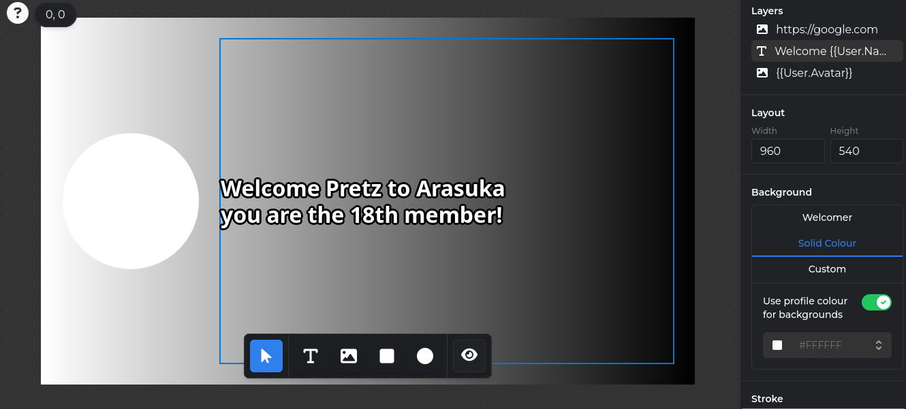
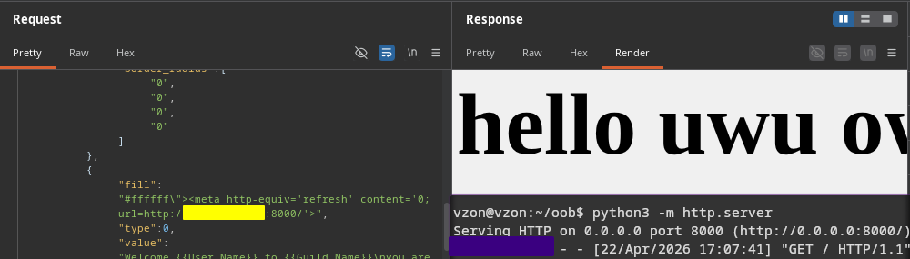
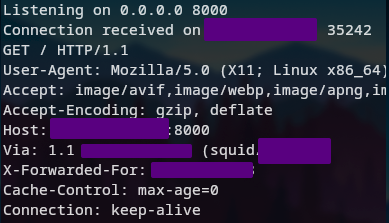

## Squid is being very squid
*Fixed on: 22/04/2026*

[Website](https://welcomer.gg) | [Discord](https://welcomer.gg/support)

This bot is basically for what his name indicates: welcoming functions. And it's [open source](https://github.com/WelcomerTeam/Welcomer)

The main function of the bot has an image builder to customize your welcome image, letting you add layers like custom images 



There's a preview feature, and it sends this request via `POST` to `/api/guild/{guild_id}/welcomer/builder/preview` with this JSON:

```json
{
    "fill":"solid:profile",
    "layers":[
        {
            "fill":"#ffffff00",
            "type":1,
            "value":"https://google.com",
            "stroke":{
                "color":"#ffffff00",
                "width":0
            },
            "position":[263,102],
            "rotation":0,
            "dimensions":[373,109],
            "inverted_x":false,
            "inverted_y":false,
            "border_radius":["0","0","0","0"]
        },
        // ... [snip]
    ],
    "stroke":{
        "color":"#00000000",
        "width":0
    },
    "dimensions":[960,540]
}
```

Inspecting the code, I noticed that all this data is going to be rendered into a HTML page, and the image that is rendered is a capture of that HTML page from a Chrome headless browser. Some of these attributes will be parsed to CSS styles, and the `layers[n].fill` has an interesting code for parsing:

```go
// welcomer-images-next/service/generator.go
func (is *ImageService) getFillAsCSS(ctx *ImageGenerationContext, value, defaultValue string) string {
	if len(value) == 0 {
		return defaultValue
	}

	if value[0] == '#' {
		return value
	}

	if value == "solid:profile" {
		if ctx.User.Avatar != "" {
			if src, err := is.fetchImageFromURL(ctx.Context, welcomer.GetUserAvatar(&ctx.User)); err == nil {
				return getImageLumainceAsHex(src)
			}
		}

		return defaultValue
	}

	if len(value) >= 4 && value[:4] == "ref:" {
		return "url(https://www.welcomer.gg/api/guild/" + ctx.Guild.ID.String() + "/welcomer/artifact/" + url.QueryEscape(value[4:]) + ")"
	}

	if _, ok := backgrounds[value]; ok {
		return "url(https://www.welcomer.gg/assets/backgrounds/" + value + ".webp)"
	}

	return defaultValue
}
```

This just returns the value as it is if starts with `#`, and as it's going to be inside a `style` attribute, that means we can append a `">` and inject any HTML that we want:



Moreover, a squid proxy was being used to hide the real source address of the headless browser... but the `X-Forwarded-For` was leaking it anyways:



As the others, the dev took some hours to fix it.