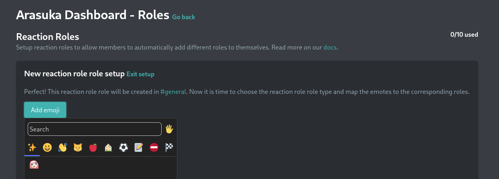
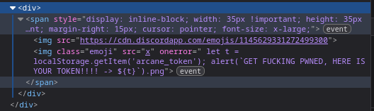
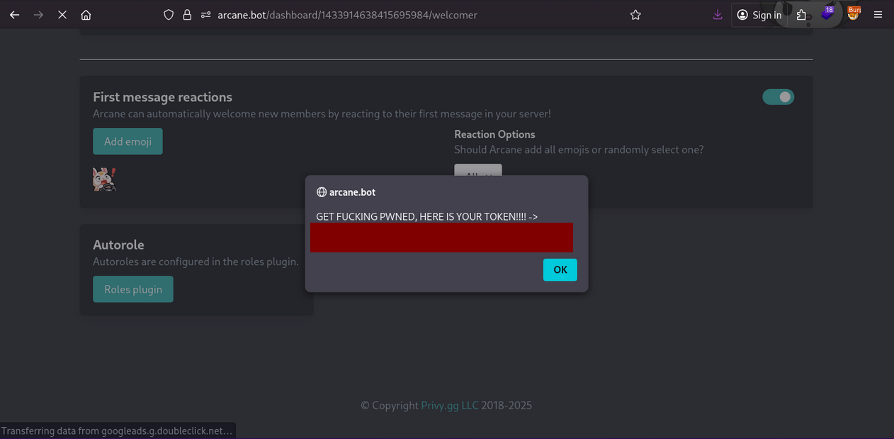

## Emojis aren't my thing
*Fixed on: 11/11/2025*

[Website](https://arcane.bot) | [Discord](https://discord.gg/arcane)

Arcane is a bot mainly used for his leveling system. It has some other functions like custom commands, welcome/goodbye.

On a setting that lets you add an emoji, you can add a custom or default one:



The emoji is sent raw on requests JSON:

```json
{
    "emojis":[
        {
            "emote":"02_derp:1489673649689722990",
            "role":"",
            "type":"default",
            "role_id":"1482044605305454623"
        }
    ]
}
```

Being on the Welcome module, I was noticing that on custom emojis, every extra character that you add to the emoji was getting rendered by the backend:

```html

```

I added a `"`, and it started to bug:

```html

```

So, I closed the img tag and started a new tag with anything that I want... and well:





This was present on every module where you can select emojis.

I reported this to the dev, and he got upset because I used swear for the alert messages (yeah, absolutely dumb) and asked me for a better explanation... meanwhile, he fixed the issue without saying anything.