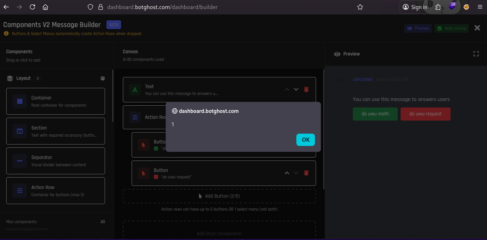

*Fixed on: 27/03/2026*

[Website](https://botghost.com) | [Discord](https://discord.gg/botghost)

BotGhost is a website for creating bots without pretty little knowledge of coding, basically a no-code platform for Discord bots. It became popular since the case that [it had a vulnerability](https://www.youtube.com/watch?v=lUiLBBab1RY) where you can get any bot token and then [Discord for some reason tried to take it down](https://www.youtube.com/watch?v=gKtqAYbGvPs)

Their new V2 components builder was processing any HTML tag without sanitization whatsoever, so you could add something simple like ``:

And the old message builder was removing the dangerous attributes like `onerror` of the tag, but you could still put links like `<a href="javascript:alert(1);">click me</a>` and insert other weird HTML tags.

As the other issues, after the devs received the message it was quickly solved.