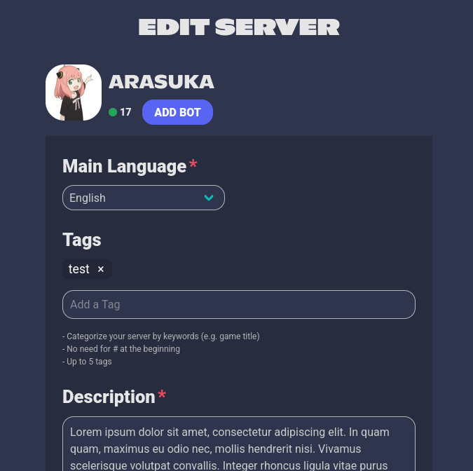
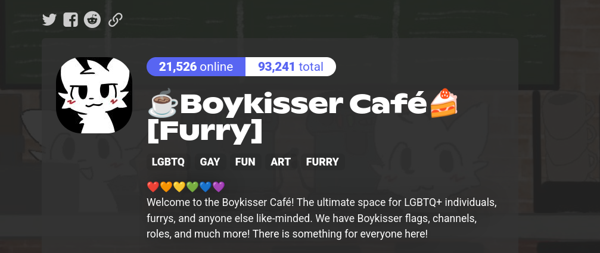
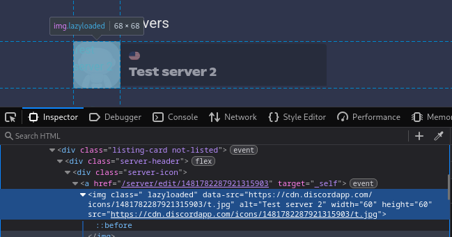
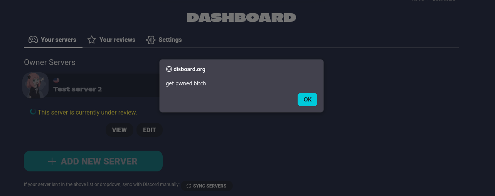

## omg those servers are ver- WTF IS THAT ALERT????

[Website](https://disboard.org) | [Discord](https://discord.gg/wu3g3Az)

Disboard is a very well known website where owners can list their servers so other users can search for them. It's pretty simple.

On your dashboard, where you can see your listed servers, you have a form to edit it:



This is sent via `POST` to `/server/edit/$server_id`:

```pwsh
_csrf=<token>&Server%5Blanguage_id%5D=9&Server%5BtagsString%5D=<server tags>&Server%5Bdescription%5D=<server desc>&Server%5Bnsfw%5D=0|1&Server%5Bpublic%5D=0|1&save-button=
```

or, decoded:

```pwsh
_csrf=<token>&Server[language_id]=9&Server[tagsString]=<server tags>&Server[description]=<server desc>&Server[nsfw]=0|1&Server[public]=0|1&save-button=
```

You may be thinking on putting strange things on fields like the description, but let's think on something else; if you look a normal server you may see that there are elements like the icon and banner. For example:



If we look at our dashboard, we can see that there is a sync button, and if we update the server icon, it won't be updated until we hit that button... so the icon must be stored somewhere. Then I added to the above request `Server[icon]=t`, and on the page:



As this is a trusted attribute that was not supposed to be controled by the user, getting XSS was trivial:



That will be rendered wherever this server appear with the modified attribute, including the server listing itself. So anyone who were searching for tags that this server has for example, it will get this.

The dev took some days to read my message, but once he readed it, he fixed the issue quickly.