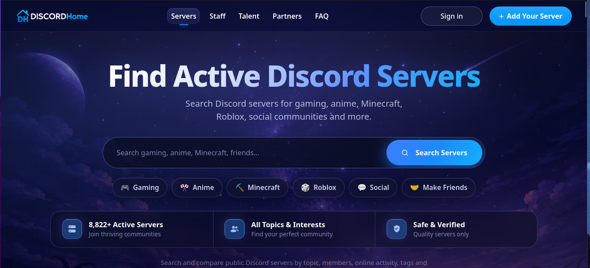
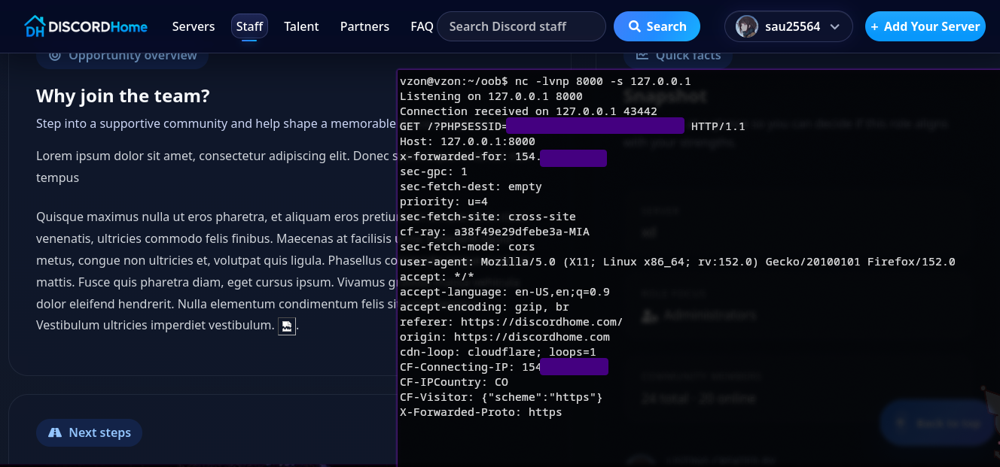

## Pretty sure this is the only relevant section
*Fixed on: ??/09/2026*

[Website](https://discordhome.com) | [Discord](https://discord.gg/maDWmB4)

This is another server listing site like Disboard, but this one is also service focused: It offers server owners and people ways to search for staff and find jobs related to Discord communities management.



On the main site part (server listings), I tried to do the basic XSS stuff but tag opener and closer characters (`<>`) were getting stripped from the final text. Then I saw the staff listings section and... on almost every text field (long/short description for example), HTML tags weren't getting stripped and rendered as normal HTML. The Cloudflare WAF was present but by using something like this:

```html
Lorem ipsum dolor sit amet, consectetur adipiscing elit. Donec scelerisque in tortor non tempus. Quisque maximus nulla ut eros pharetra, et aliquam eros pretium. In ornare mi in risus venenatis, ultricies commodo felis finibus. Maecenas at facilisis urna. 
```

You easily bypass it:



This was also working on the partners and jobs (talent) listings. A funny thing is that the short description of a job listing was shown as preview in the main search page (https://discordhome.com/talent/), and that every new listing was getting added at the top of the page. That certainly gives a blast radius.

Another thing is that this site asks for the "Join servers for you" (`guilds.join` at OAuth2) scope when you log-in, so when you click the "Join" button (which is a `GET` to `/join/{listing.id}`) the listing bot (DH Bump) automatically tries to add you to the server. With this XSS, you can make users join to servers which had the bot and other stuff.

Don't know when exactly the dev fixed it and how much it took because he didn't say anything but yeah... it's fixed now.