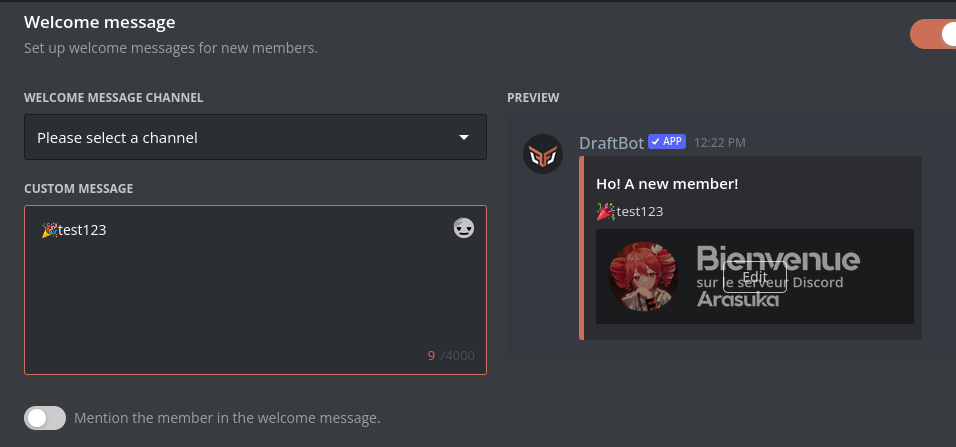
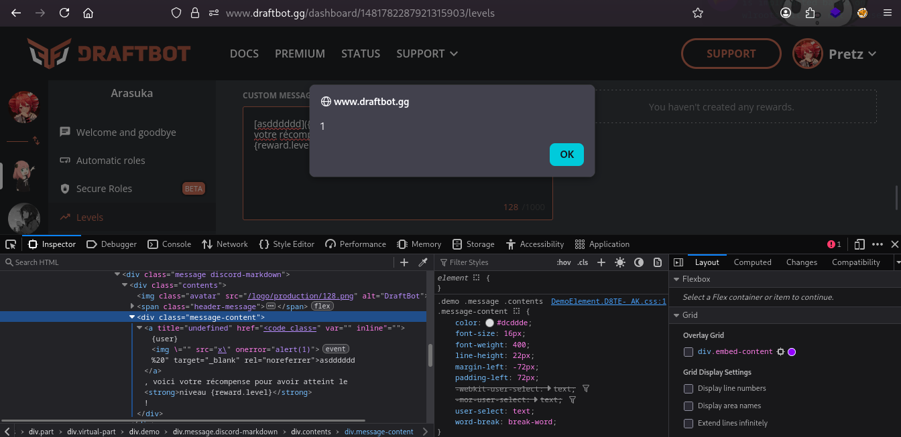
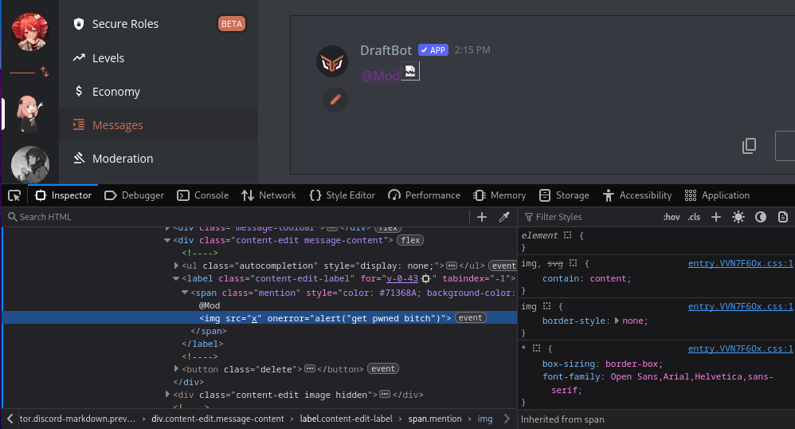

## Parse this anywhere
*Fixed on: 25/04/2026*

[Website](https://draftbot.gg) | [Discord](https://discord.gg/3y4HWyFHPX)

DraftBot is a (mainly) multi-purpose french bot with various functions like Dyno and Sapphire.

On most modules where a message is going to be sent, you can preview it:



It render variables like `{user}` with a special formatting, but this formatting is still applied even if the variable is just an attribute of another element, like a `href` from an anchor element... so you end with this wacky HTML if you put `[asdddddd]({user})` (we are on the levels module):

```html
<div class="message-content">
  <a title="undefined" href="&lt;code class=" var="" inline"="">{user}" target="_blank" rel="noreferrer"&gt;asdddddd</a>, voici votre récompense pour avoir atteint le <strong>niveau {reward.level}</strong> !
</div>
```

I noticed that if you put a HTML tag inside in the link, it's rendered as part of the page as this:

```html
<div class="message-content">
  <a title="undefined" href="&lt;code class=" var="" inline"="">{user}
  <h1" target="_blank" rel="noreferrer">asdddddd</h1">
  </a>, voici votre récompense pour avoir atteint le <strong>niveau {reward.level}</strong> !
</div>
```

By putting a url-encoded char at the end of the link description (`[asdddddd]({user}<h1>%21)`) , it becomes into an actual tag:

```html
<div class="message-content">
  <a title="undefined" href="&lt;code class=" var="" inline"="">{user}</a>
  <h1>
    <a title="undefined" href="&lt;code class=" var="" inline"="">%21" target="_blank" rel="noreferrer"&gt;asdddddd</a>, voici votre récompense pour avoir atteint le <strong>niveau {reward.level}</strong> !
 </h1>
</div>
```

Then by escaping the space character and adding two slashes after the tag name, you can add arbitrary tags with any attribute. This happens with the payload `[asdddddd]({user}%21)`:



The site was also parsing HTML tags in things like a role name:



The dev took some hours to fix it.