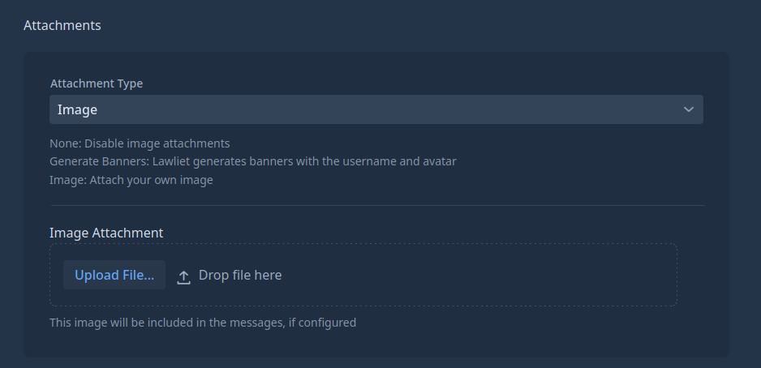
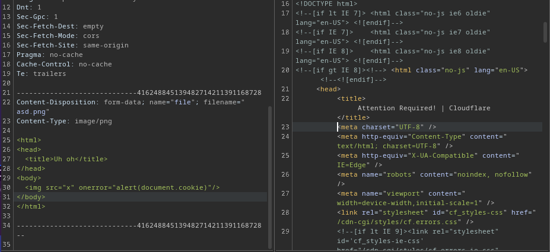
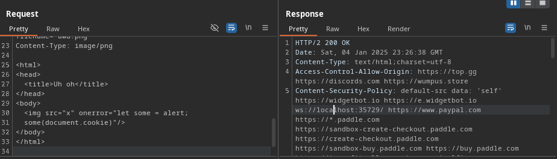
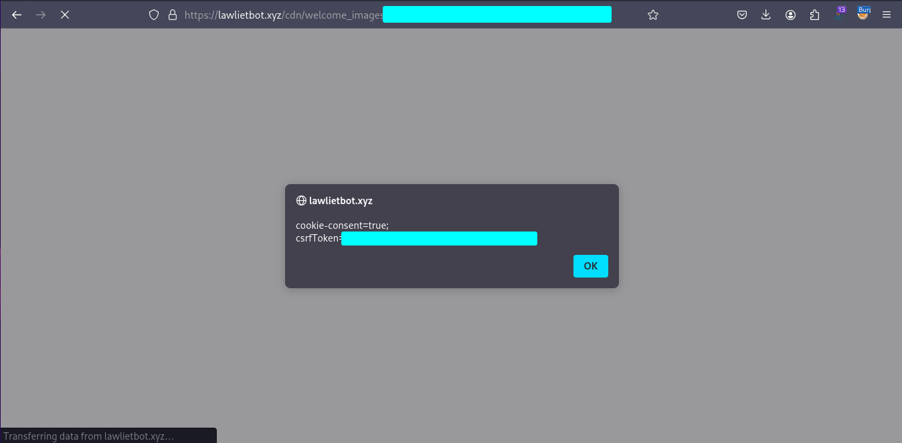
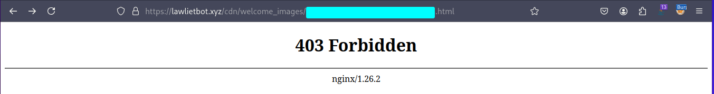

## Oh, an image/jpeg? sure go ahead
*Fixed on: ??/01/2025*

[Website](https://lawlietbot.xyz/) | [Discord](https://discord.gg/F4FcAbQ)

Lawliet is another multipurpose bot like Nekotina, it offers roleplay commands, moderation, and so on. It's [open source](https://github.com/Aninoss/lawliet-bot)

It has modules where you can upload images:



Starting to tamper with this was a bit complicated, as the bot's dashboard is using Vaadin, a software just like .NET Blazor but for Java. Every button and action that you make is sent as an event on an active connection to the server, and intercepting requests can make noise.

So well, files are uploaded on a `POST` request with this content:

```bash
-----------------------------88073330513477986272418408347
Content-Disposition: form-data; name="file"; filename="uwu.png"
Content-Type: image/png

... [image data]

-----------------------------88073330513477986272418408347--
```

If I change the filename extension to js and I put plain text instead of binary image data, the request still success, and the mimetype reported by the server is according to the file extension:


```bash
< HTTP/2 200 
< date: Sat, 04 Jan 2025 22:51:21 GMT
< content-type: text/javascript;charset=utf-8 <------
< content-length: 7
< cache-control: max-age=14400
< last-modified: Sat, 04 Jan 2025 22:50:39 GMT
< cf-cache-status: HIT
< age: 31
< accept-ranges: bytes
< report-to: {"endpoints":[{"url":"https:\/\/a.nel.cloudflare.com\/report\/v4?s=NfEkVwYvzuYSx5gXRu2Zmjahc04FCbi44o82UApdfPJ9VN3nk%2B5r7woBCEYm4PcNr%2FomDecX9aZUTjawWpfr9an0BTXtM2IvAVnyFl%2B0r9jbclD3JNp6jGHWaPk04MulMQ%3D%3D"}],"group":"cf-nel","max_age":604800}
< nel: {"success_fraction":0,"report_to":"cf-nel","max_age":604800}
< server: cloudflare
< cf-ray: 8fcecaf55d45d9c1-MIA
< alt-svc: h3=":443"; ma=86400
< server-timing: cfL4;desc="?proto=TCP&rtt=97216&min_rtt=96601&rtt_var=37456&sent=6&recv=6&lost=0&retrans=0&sent_bytes=3435&recv_bytes=765&delivery_rate=41369&cwnd=129&unsent_bytes=0&cid=549b53d098d812ac&ts=135&x=0"
< 
uwuowo
* Connection #0 to host lawlietbot.xyz left intact
```

So, what will happen if I upload a HTML file? The CDN is located at `https://lawlietbot.xyz/cdn/<directorio>/`, so getting XSS in here could be harmful as cookies are present.

While I was trying to upload a HTML page with some malicious content, the Cloudflare WAF popped up:



But bypassing it was funnily easy:



And welp, nothing... XSS.



I reported it to the dev and said me that he noted it. Don't known exactly when the guy got into it, but the fix was just blocking the access to all files with html extension.

