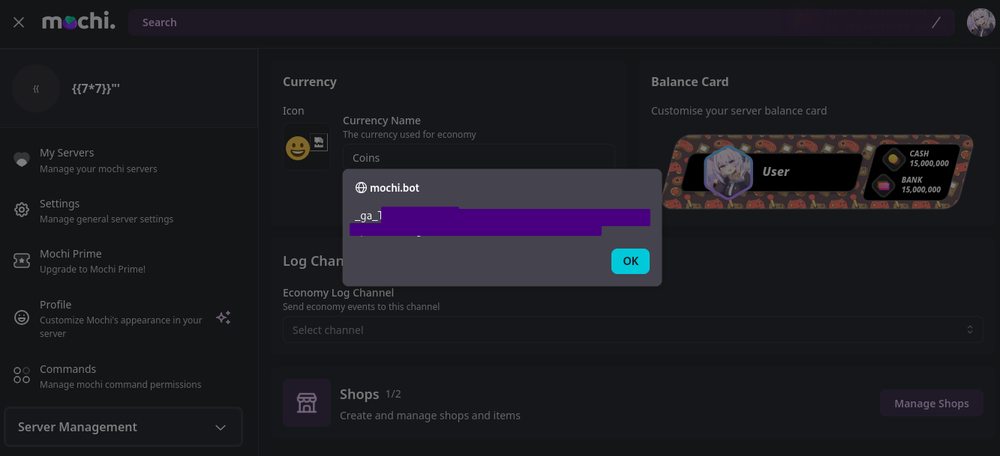
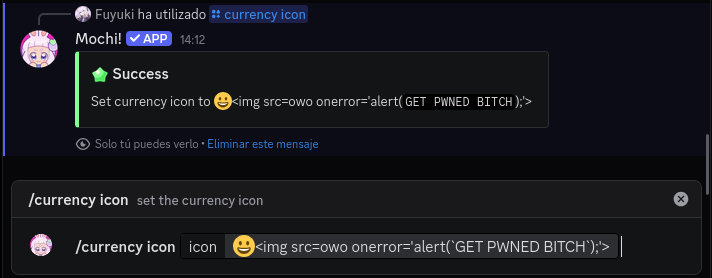

## Currency emoji? or anything else!
*Fixed on: 06/03/2026*

[Website](https://mochi.bot) | [Discord](https://discord.gg/krsFJDS2hA)

Mochi is a anime themed multi purpose bot.

It has an economy module, and it lets you choose a custom currency icon. This icon wasn't validated and tought as a part of the page, so you could inject HTML tags with the emoji:

You could also modify it from Discord with a command, so anyone with access to it is capable of making weird things against whoever visits the dashboard

The bug was fixed by an admin.