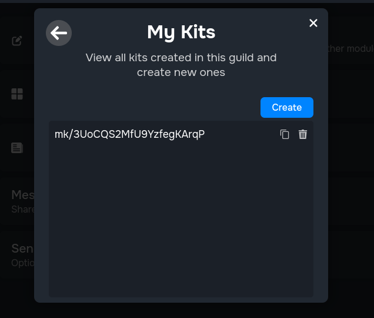
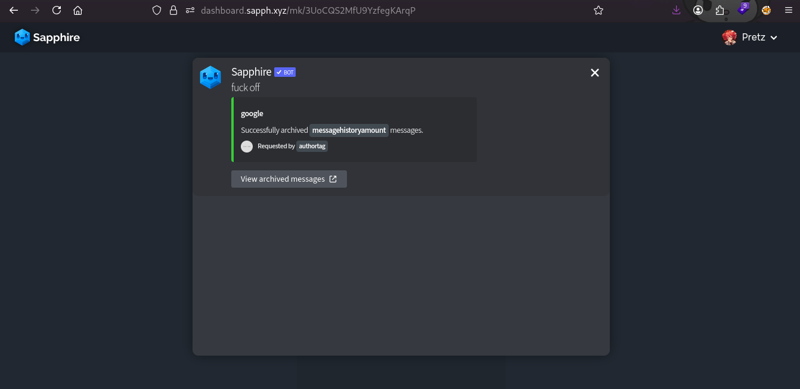
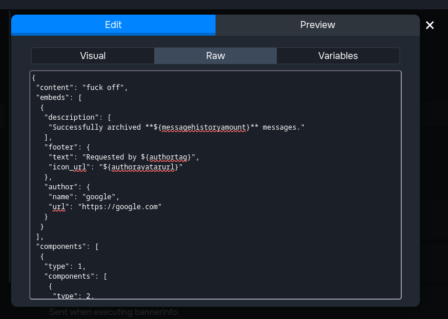
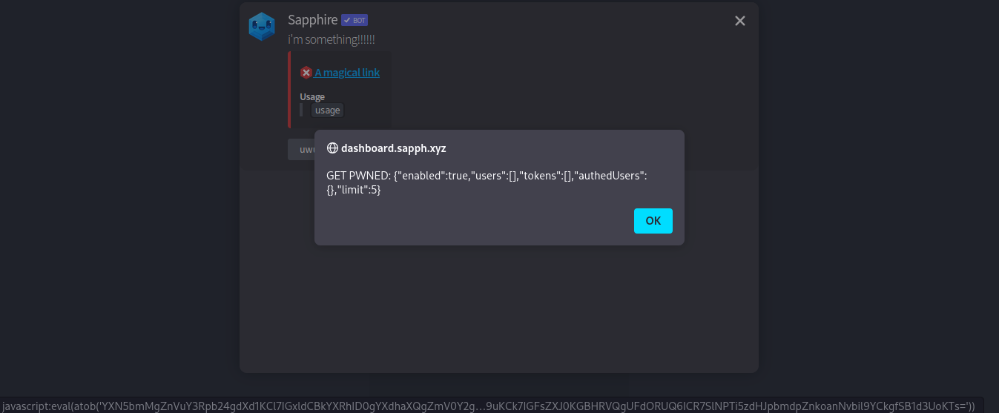

## Take this message kit... and click the link of the embed, trust me!
*Fixed on: 06/01/2025*

[Website](https://sapph.xyz) | [Discord](https://sapph.xyz/server)

Sapphire is a well known bot around the Discord community, and it has various good features for server owners, like AI moderation.

The bot gives users an option to make message kits; custom bot messages that other users can view and implement. This is useful for translations of the bot to other languages and so on.

The message kit can be viewed on a separate page of the form `https://dashboard.sapph.xyz/mk/$message_kit_id`. You can click every message to see a rendered preview of it

Now, going back to the messages section of the dashboard, when you edit a message, it will let you edit his JSON:

On every thing where you can put a URL, I tried to add a `javascript:alert(1)` URL, and it worked, and so on the message kit preview:

So, anybody who visits that message kit and presses a link, it will get XSSed.

The dev quickly fixed it after reporting.