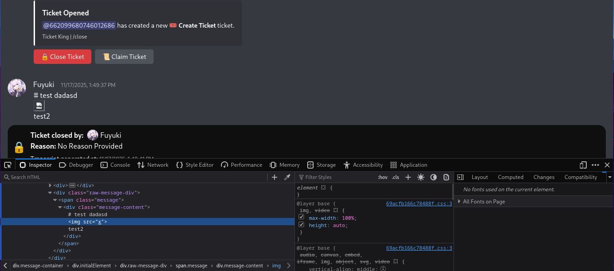
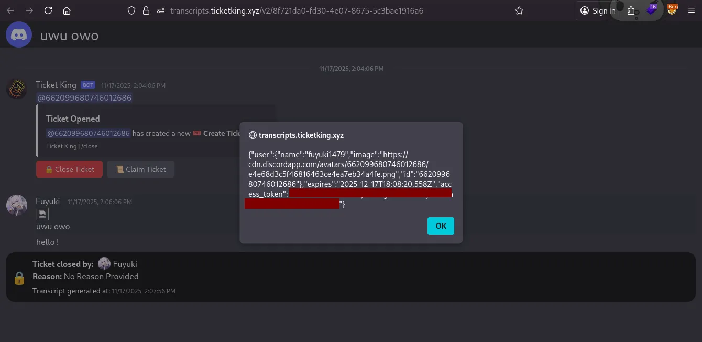

## Hey uhhhh, I wanted to buy your product but then the page said me this and I don't know what to do, you're staff here, could you help me?
*Fixed on: 18/11/2025*

[Website](https://ticketking.xyz/) | [Discord](https://ticketking.xyz/discord)

It's another ticket managing bot, just like Ticket Tool.

On the ticket transcript, every HTML tag introduced by any user was being parsed without any questions:

Getting XSS is pretty easy:

This issue is really funny, like, imagine that somebody extends the ticket conversation way too much and then edits an old message with a HTML tag with some JavaScript payload; when somebody views that transcript, boom.

The dev took some time to fix the issue.