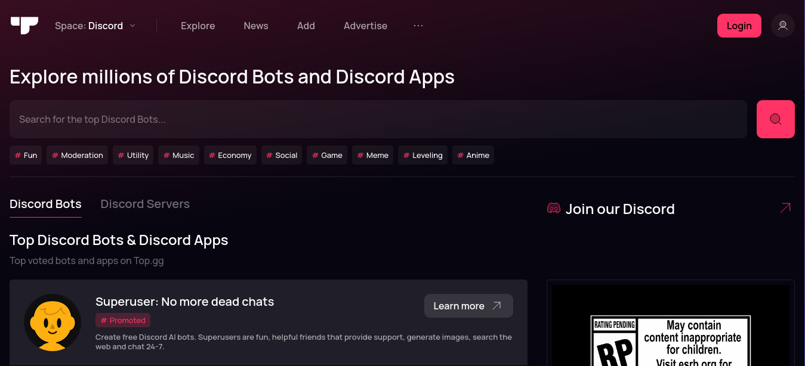
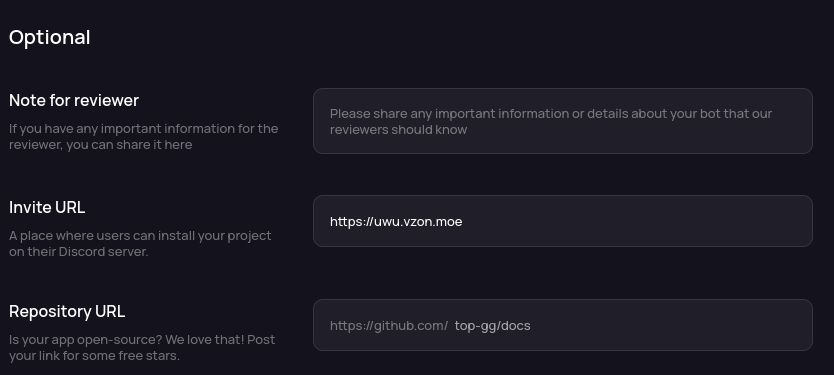
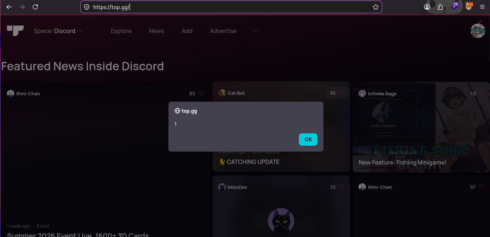

## Invite ma bot!1!!!!!
*Fixed on: 12/07/2026*

[Website](https://top.gg) | [Discord](https://discord.gg/dbl)

This website is the largest bot/server listing across Discord. Most Discord server admins come to here to search bots for their servers.



So, I noticed that you can set any link for the bot invite, which is the one that top.gg redirects to when you hit the `Invite` button in the bot project page:



Seems innocent, but I noticed that the frontend was prefetching the link rather than just redirecting to it:

```bash
GET /bot/[bot_id]/invite?_rsc=AnZnK6Nm6TZijOb5
... [snip]
Rsc: 1
Next-Router-State-Tree: %5B%22%22%2C%7B%22children%22%3A%5B%5B%22locale%22%2C%22en%22%2C%22d%22%2Cnull%5D%2C%7B%22children%22%3A%5B%22(default)%22%2C%7B%22children%22%3A%5B%22bot%22%2C%7B%22children%22%3A%5B%5B%22id%22%2C%22[bot_id]%22%2C%22d%22%2Cnull%5D%2C%7B%22children%22%3A%5B%22(public)%22%2C%7B%22children%22%3A%5B%22(project)%22%2C%7B%22children%22%3A%5B%22__PAGE__%22%2C%7B%7D%2Cnull%2Cnull%2C0%5D%7D%2Cnull%2Cnull%2C0%5D%7D%2Cnull%2Cnull%2C0%5D%7D%2Cnull%2Cnull%2C0%5D%7D%2Cnull%2Cnull%2C0%5D%7D%2Cnull%2Cnull%2C0%5D%7D%2Cnull%2Cnull%2C16%5D%7D%2Cnull%2Cnull%2C0%5D
Next-Url: /en/bot/[bot_id]
```

The `/bot/[bot_id]/invite` route just returns a `307` redirect to the invite URL.

If you read the [Dank Memer](/xss/dank_memer.md) case, you might know that this is a React Server Components (RSC) preflight request, and it's expecting a `text/html` or a `text/x-component` response mimetype. The `text/x-component` is a serialized format that the React client renders as a raw HTML inside the same origin that initiated the request, and the request is going to be redirected to my server.

So this means that I can just take a serialized response from the same site (as example, `https://top.gg/discord/news?_rsc=AnZnK6Nm6TZijOb5`), and make my server to send it as response. When somebody clicks the `Invite` button with it, they will just see that page... but now, as I have full control, I can add this funny thing to the serialized response:

```json
["$", "div", null, {"dangerouslySetInnerHTML":{"__html":""},"data-cfasync":"false"}]
```

And would get rendered by the client:



On this one, I didn't need an open redirect as the same server was redirecting to the invite URL, as intended.

The devs took a while to fix it.