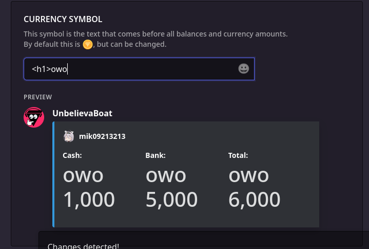
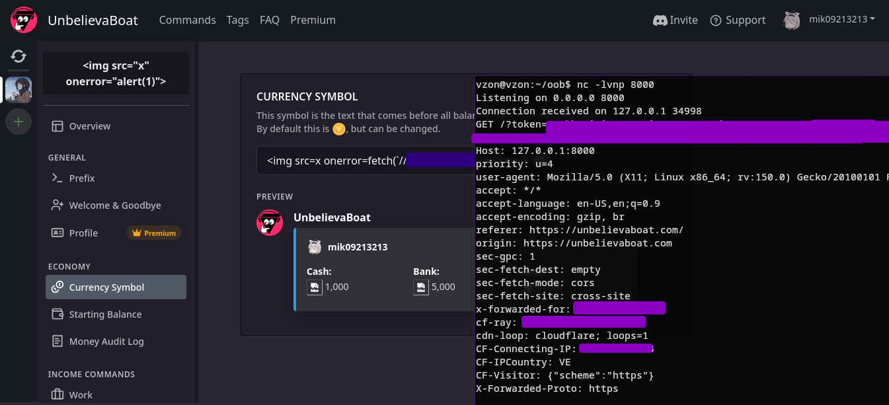

## Currency emoji? or anything else! (now with Pizza included)
*Fixed on: 03/06/2026*

[Website](https://unbelievaboat.com) | [Discord](https://discord.gg/unb)

It's a bot that is mainly used for creating a "custom" economy system into servers. Allows you to personalize some aspects and also create your own currency and items.

The bot allows you to change the currency icon, it allows putting anything that it's not greater than 100 characters, and for some reason it was rendering HTML tags:



I can easily get the typical `alert(1)` XSS example here, but the catch is that with only 100 characters available, I can't do much... however, this site saves the access token inside the browser local storage, so I can easily send it to one of my servers with something like this:

```

```



As the Mochi one, you could also configure the currency icon from Discord.

The devs fixed it quickly.