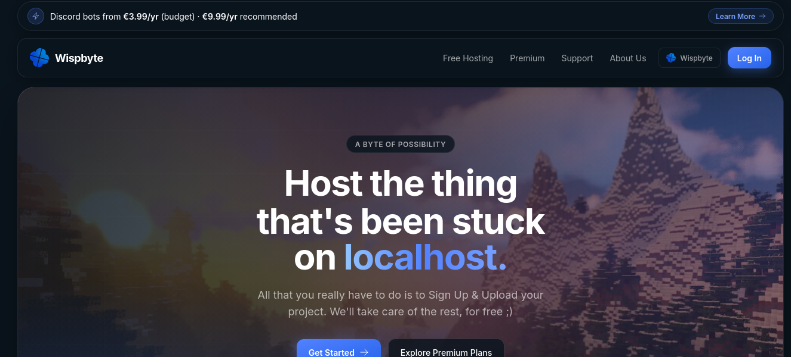
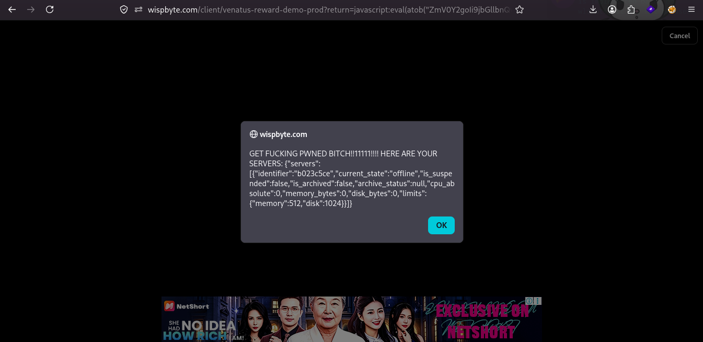

## Rewarding some :3 JavaScript
*Fixed on: 13/07/2026*

WispByte is a hosting platform mainly designed for Discord bots, but it also supports hosting other things like Minecraft servers. It has free and premium plans.



Inspecting the dashboard, I found some URLs related to ads videos (`/client/venatus-reward-demo-prod` and `/client/venatus-reward-demo`) that are triggered when you try to do certain actions like turning on a server. To return back the user to the URL where they was before, the page does a client side redirect with some checks:

```js
function parseReturnUrl() {
    if (!returnUrl) return null;
      try {
        if (/^https?:\/\//i.test(returnUrl)) return new URL(returnUrl);
        return new URL(returnUrl, location.origin);
      } catch (e) {
        ccLog('invalid return url', returnUrl, e);
        return null;
    }
}
```

Welp, this does not verify if the URL if the same as the origin, and on pseudo-protocols like `javascript:`, the second parameter (the base) has no effect:

```js
> let t = new URL("javascript:alert('cock')", "https://wispbyte.com")
undefined
> t
URL {
  href: "javascript:alert('cock')",
  origin: 'null',
  protocol: 'javascript:',
  username: '',
  password: '',
  host: '',
  hostname: '',
  port: '',
  pathname: "alert('cock')",
  search: '',
  searchParams: URLSearchParams {},
  hash: ''
}
```

The last thing that the site does before issuing the redirect, is adding a query parameter. On this pseudo-protocol, the JS engine just adds it without any questioning:

```js
> t.searchParams.append("rewardFailed", "1")
undefined
> t
URL {
  href: "javascript:alert('cock')?rewardFailed=1",
  origin: 'null',
  protocol: 'javascript:',
  username: '',
  password: '',
  host: '',
  hostname: '',
  port: '',
  pathname: "alert('cock')",
  search: '?rewardFailed=1',
  searchParams: URLSearchParams { 'rewardFailed' => '1' },
  hash: ''
}
```

So with a URL like `javascript:<code>//` you easily get XSS after watching the ad or when the site redirects you, if for some reason the ad does not load:



Seems a bit complicated, but I'm pretty sure that there are people that will fall for it if you tell them that the site is giving a big reward for watching ads under a crafted link.

The dev took a while to read my messages, but once he readed them, it fixed the issue quickly.